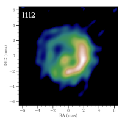

# OITOOLS: the All-in-One Tool Package for Optical Interferometry

|     **Status**                  | **Documentation**               | **License**                     |**Build**                      |
|:--------------------------------|:--------------------------------|:--------------------------------|:------------------------------|
| [![][proj-img]][proj-url] | [![][doc-dev-img]][doc-dev-url] | [![][license-img]][license-url] | [![][build-img]][build-url] |

[proj-img]: http://www.repostatus.org/badges/latest/active.svg
[proj-url]: http://www.repostatus.org/#active

[doc-dev-img]: https://img.shields.io/badge/docs-dev-blue.svg
[doc-dev-url]: https://fabienbaron.github.io/OITOOLS.jl/dev

[license-url]: ./LICENSE.md
[license-img]: http://img.shields.io/badge/license-GPL3-brightgreen.svg?style=flat

[build-img]: https://github.com/fabienbaron/OITOOLS/workflows/CI/badge.svg
[build-url]: https://github.com/fabienbaron/OITOOLS/actions

<center>


</center>

OITOOLS is a Julia package to read, plot, model-fit and image optical interferometric data coming from astronomical arrays such as CHARA, VLTI, and NPOI. Note that despite having the same name as [JMMC's oitools](https://github.com/JMMC-OpenDev/oitools), they are completely unrelated and were developed independently.

## Installation and Documentation

[How To Install](https://github.com/fabienbaron/OITOOLS.jl/blob/master/docs/src/install.md)

[Documentation](https://fabienbaron.github.io/OITOOLS.jl/dev/)

## Plotting and loading data

* Load and filter data on the fly: split by spectral channel or time

* All the classic plots: uv coverage, V2, T3, etc. by baseline or wavelengths

|    **uv coverage**                  | **V2**               |
|:--------------------------------:|:--------------------------------:|
|   |  |

## Image reconstruction

* Classic image reconstruction




* Polychromatic and dynamical imaging with several regularizations

* The [ROTIR](https://github.com/fabienbaron/ROTIR.jl/) package uses OITOOLS to do stellar surface imaging with:
  + light curve inversion
  + Doppler imaging
  + interferometric imaging


## Model fitting

* Fast multiple component fitting.

* Polychromatic models
  + Power and black-body laws
  + Spectral line fitting
  + Add your own laws!

* Dynamical models (time variable parameters)

* Optimization with several libraries
  + Levenberg for classic error analysis
  + NLOpt for flexibility in the parameter search (local and global optimizers including Nelder Mead and Genetic Algorithm)
  + UltraNest for Bayesan model selection

* Derive boostrap errors
  + Boostrap by baseline, time, or wavelengths

* Quickly make images from models.

## Observation planning

|     **ASPRO-like Gantt chart**                  | **chara_plan-like plots**               |
|:--------------------------------:|:--------------------------------:|
|  |  |


## Simulations

* Can simulate fake data from models or images

* Can create your own telescope and/or instrumental configurations

## How to speed up the use of OITOOLS with PackageCompiler

Julia compiles your code on the fly, and OITOOLS functions are no exception.
The so-called "time to first plot" will significantly decrease if you take the time to compile OITOOLS with PackageCompiler,
The functions that will be accelerated are in precompile_oitools.jl from the OITOOLS.jl/demos/ directory.
Feel free to add OITOOLS functions that you frequenly use.
To precompile OITOOLS:
```julia
using PackageCompiler
create_sysimage([:OITOOLS], sysimage_path="oitools.so", precompile_execution_file="precompile_oitools.jl")
```
then launch julia with
```
julia --sysimage oitools.so
```
